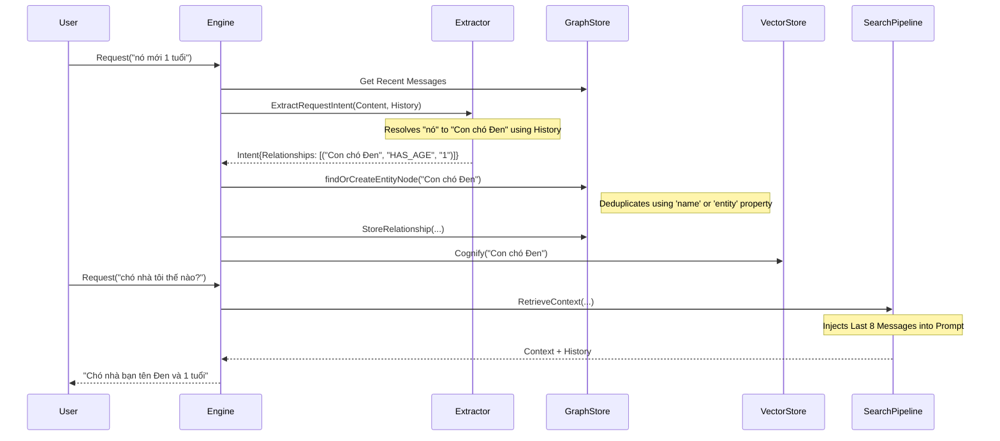
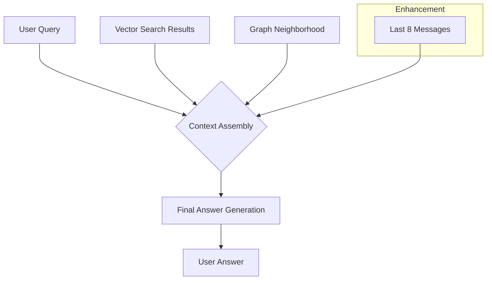

# Detailed Design - Chat History Bug Fix

This document provides a technical deep-dive into the architectural changes made to fix the attribute recall and pronoun resolution issues in the `chat_history_agent`.

## Architecture Overview

The fix involves tightening the loop between **Intent Extraction**, **Graph Storage**, and **Contextual Answer Generation**.

### 1. Request Pipeline with History Awareness

The `MemoryEngine.Request` pipeline now ensures that every interaction is grounded in the current conversation thread before logic is applied.

### 2. Context Injection Strategy

To guarantee that the LLM can always resolve context (even if the vector/graph retrieval has slight latency or gaps), we implement a **History Window Buffer** in the search pipeline.

## Key Components

### ExtractRequestIntent (extractor/basic_extractor.go)
- **Input**: Current Message + Session History.
- **Logic**: The prompt enforces pronoun resolution. If a pronoun is detected, the LLM must find its antecedent in the history block before outputting JSON relationships.

### Node Deduplication (engine/request.go)
- **Logic**: `findOrCreateEntityNode` now performs a two-tier search:
    1. Search by `name` property.
    2. Search by `entity` property.
- This prevents the creation of duplicate nodes like `{"name": "Đen"}` and `{"entity": "Đen"}` which can happen with different LLM behavior.

### Context Buffer (engine/search.go)
- **Logic**: Pre-generation, the engine fetches exactly 8 messages from the session store.
- These are formatted as `Role: Content` and prepended to the `Context:` block.
- This "short-term memory" buffer acts as a safety net for the "long-term memory" (vector/graph).
