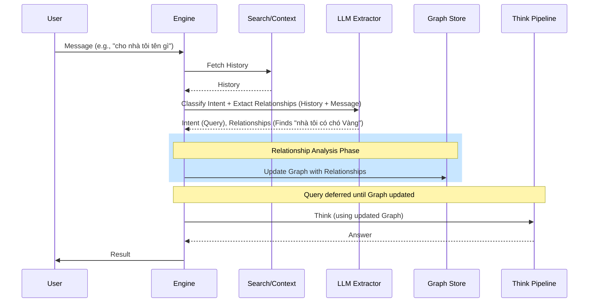

# Design: Context-Aware Request Pipeline

## Architecture Overview
The `Request` pipeline in `engine/request.go` will be restructured to prioritize context and relationship analysis.

### New Pipeline Flow
1. **Context Fetching**: Retrieve recent chat history for the session.
2. **Intent Classification & Relationship Extraction**:
   - Send current message + history to LLM.
   - LLM classifies Intent (Statement, Query, Delete) AND extracts potential relationships (bot-user, user-user).
3. **Relationship Processing**:
   - If relationships are found, run a dedicated analysis to update the Knowledge Graph.
4. **Action Routing**:
   - **Statement**: Cognify/Save memory.
   - **Delete**: Execute deletion logic.
   - **Query**:
     - *If relationship analysis was needed, wait for it to complete.*
     - Proceed to `Think` phase using the updated graph context.

## Component Changes

### 1. `schema/schema.go`
- Update `RequestIntent` to include a `Relationships` field (e.g., `[]Relationship`).

### 2. `extractor/basic_extractor.go`
- Modify `ExtractRequestIntent` prompt to specifically look for "who is talking to whom" and "who is mentioned".
- Define the relationship types: `BotToUser`, `UserToUser`.

### 3. `engine/request.go`
- Reorder logic in `Request()` method.
- Implement the "defer" mechanism for queries waiting on relationship analysis.

## Data Flow Diagram

