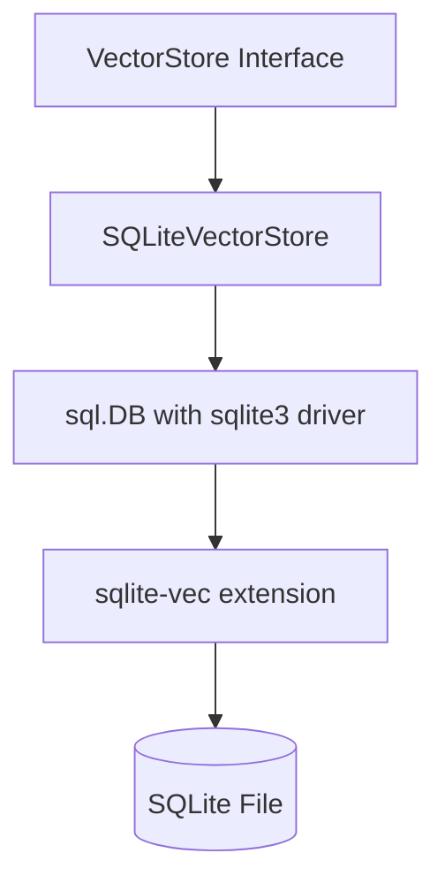

# Design: SQLite-Vec Integration

## Architecture
The system currently uses `github.com/asg017/sqlite-vec-go-bindings/cgo`. We need to ensure it's correctly initialized and used.

### Data Schema
- `vec_items`: A virtual table using `vec0`.
  - `embedding`: `float[N]` (where N is the dimension).
- `vec_meta`: A standard table for metadata and ID mapping.
  - `id`: TEXT (Primary Key).
  - `rowid`: INTEGER (Unique, maps to `vec_items`).
  - `metadata`: TEXT (JSON).
  - `created_at`: DATETIME.
  - `updated_at`: DATETIME.

### Component Diagram

### API Flow
1. **Store**: Insert metadata into `vec_meta`, get `rowid`. Insert embedding into `vec_items` with matching `rowid`.
2. **Search**: Query `vec_items` using `MATCH` and `k`, join with `vec_meta` to return IDs and metadata.
3. **Delete**: Delete from both `vec_items` and `vec_meta`.

## Implementation Details
- Use `sqlite_vec.Auto()` in `init()` to register the extension.
- Update `migrate()` to use the correct `CREATE VIRTUAL TABLE` syntax for `vec0`.
- Update `SimilaritySearch` to use the `MATCH` syntax instead of `L2` distance functions if applicable for performance.
