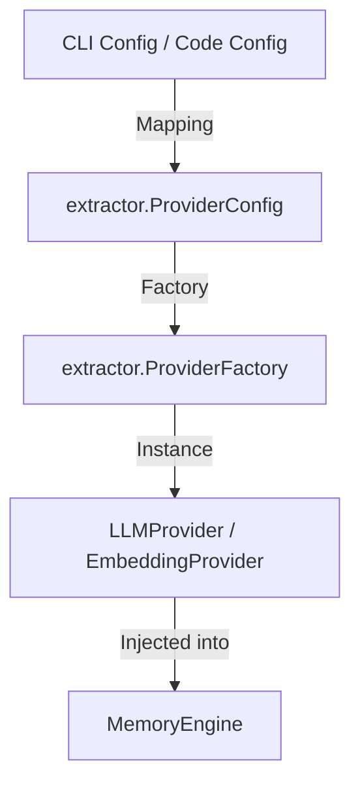

# Design: CLI and Examples Refactor

## Architecture Overview

The recent refactoring of the `extractor` package introduced a centralized `registry` and `factory` pattern for both LLM and Embedding providers. This design aims to unify provider instantiation across the codebase.

### Provider Instantiation Flow

1. **Configuration**: Use `extractor.DefaultProviderConfig(Type)` and `extractor.DefaultEmbeddingProviderConfig(Type)` to get base configurations.
2. **Customization**: Apply user-specified overrides (API keys, models, endpoints) to these config structs.
3. **Factory**: Instantiate `ProviderFactory` and `EmbeddingProviderFactory`.
4. **Creation**: Call `CreateProvider(config)` to get a provider instance that satisfies the `LLMProvider` or `EmbeddingProvider` interface.

## CLI Design Changes

### `internal/cli/config.go`
- Refactor `InitEngine` to bridge between `viper` configuration and `extractor` config structs.
- Use `extractor.NewProviderFactory()` and `extractor.NewEmbeddingProviderFactory()` (or their respective exported names) to create the providers.
- Handle potential errors from the factory for better CLI feedback.

## Examples Design Changes

### Quickstart & Specialized Bots
- Switch from hardcoded provider constructors (e.g., `vector.NewLMStudioEmbeddingProvider`) to the factory-based approach.
- Demonstrate how to handle `EmbeddingProviderConfig` for local/remote providers.

## Data Flow

