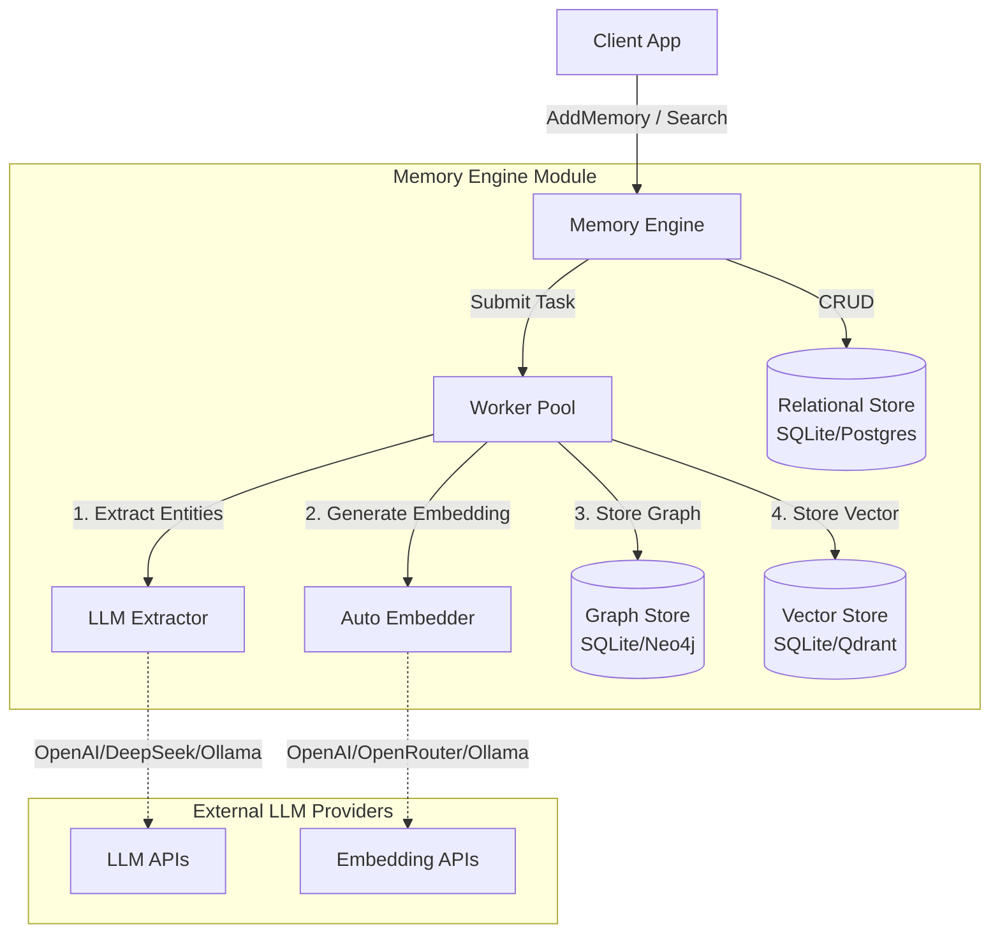
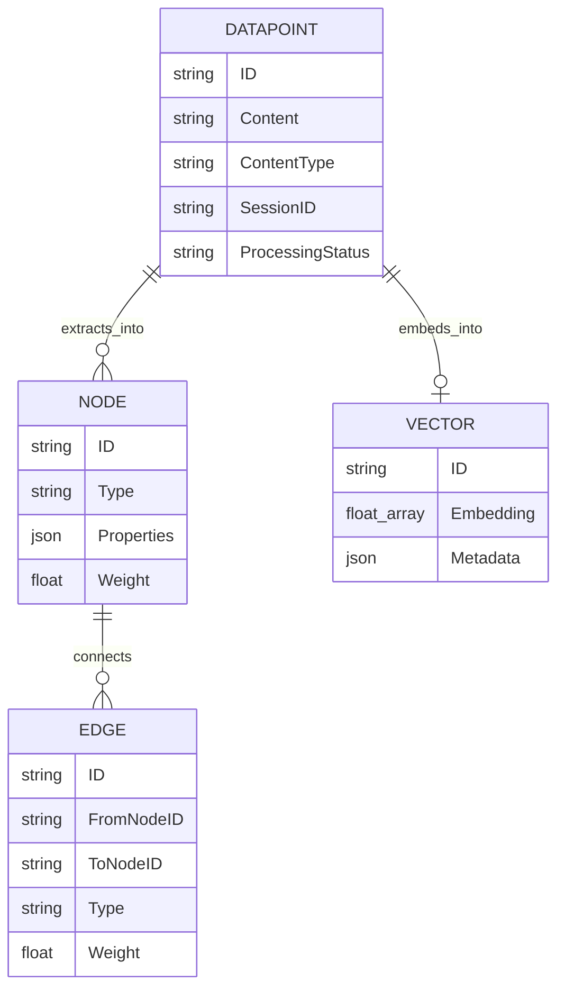
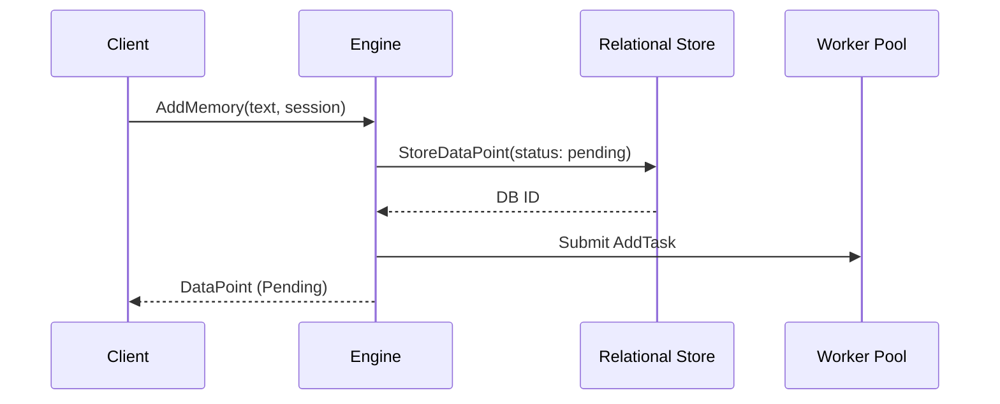
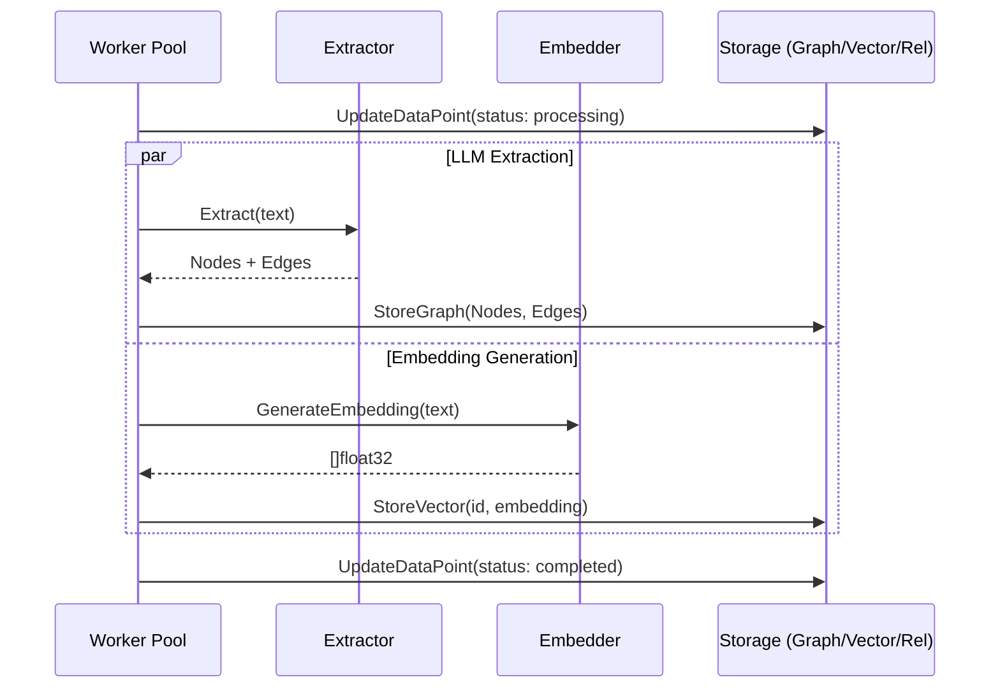
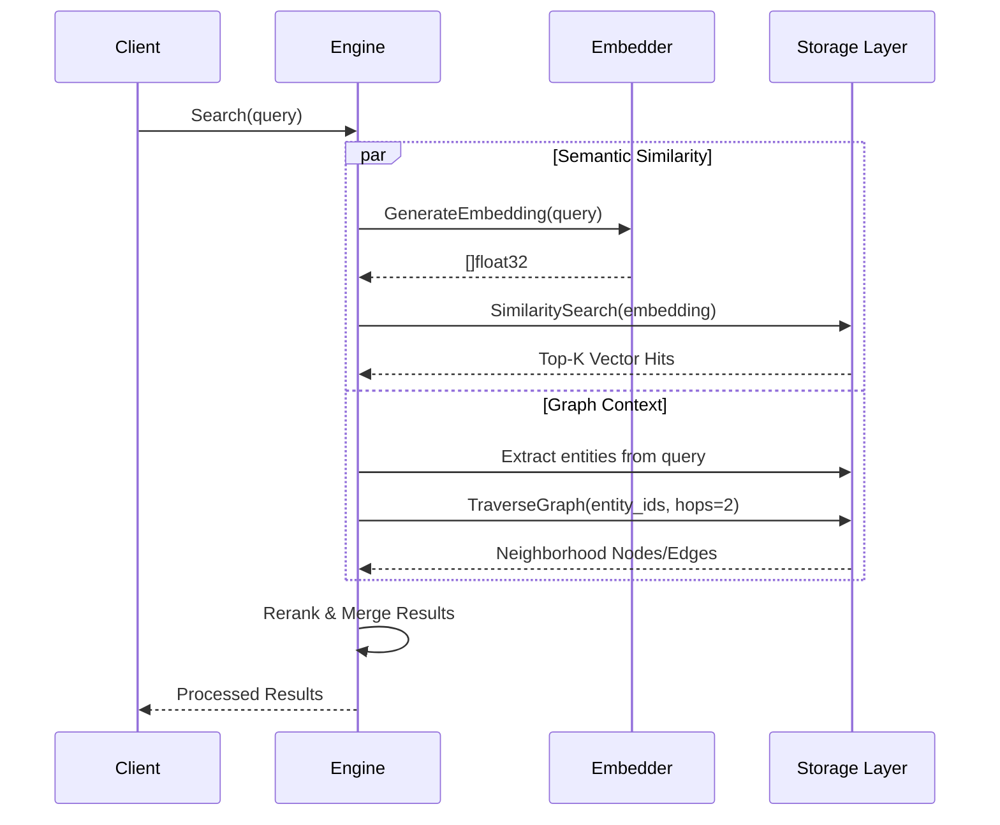

# AI Memory Brain - Architecture Overview

This document provides a comprehensive architectural analysis and data flow specification for the `ai-memory-go` integration project. 

The system implements a unified "Memory Engine" that ingests text, extracts entities/relationships using Large Language Models (LLMs), generates vector embeddings, and stores this data in a hybrid graph-vector storage backend for semantic and relational retrieval.

## System Architecture

## Data Model

The system operates on three distinct layers of data:

1.  **DataPoint (Relational):** Represents the raw input text, metadata, and processing state.
2.  **Node & Edge (Graph):** Represents the extracted concepts and their relationships.
3.  **Vector (Embedding):** Represents the semantic mathematical representation of the text or extracted chunks.

## Core Workflows

### 1. `AddMemory` Flow (Ingestion)

When new information is added, the engine responds immediately by storing the raw `DataPoint` as `pending` and asynchronously processing it via the worker pool.

### 2. `Cognify` Flow (Extraction & Vectorization)

The asynchronous background worker processes the pending data.

### 3. `Search` Flow (Hybrid Retrieval)

The search pipeline takes a query and retrieves relevant data using both mathematical similarity (Vectors) and relational context (Graph).

## Package Dependencies & Capabilities

-   **`extractor`**: Abstraction over large language models for structured entity extraction. Implements `Anthropic`, `DeepSeek`, `Gemini`, `Ollama`, and `OpenAI`.
-   **`vector`**: Abstraction over embedding models and vector databases. Implements `AutoEmbedder` (with local caching and fallbacks), `Ollama`, `OpenAI`, and `OpenRouter` providers. Storage backends include `SQLite` (`sqlite-vec`), `Qdrant`, and `PgVector`.
-   **`graph`**: Abstraction over knowledge graph operations (node creation, edge linking, recursive BFS traversal). Implements `SQLite` (Recursive CTE) and `Neo4j`.
-   **`storage`**: Traditional relational data store for the primary `DataPoint` tracking, implementing `SQLite` and `PostgreSQL`.
-   **`engine`**: The overall orchestrator wrapping the extractor, embedder, and storage layers, maintaining a concurrent `WorkerPool`.
