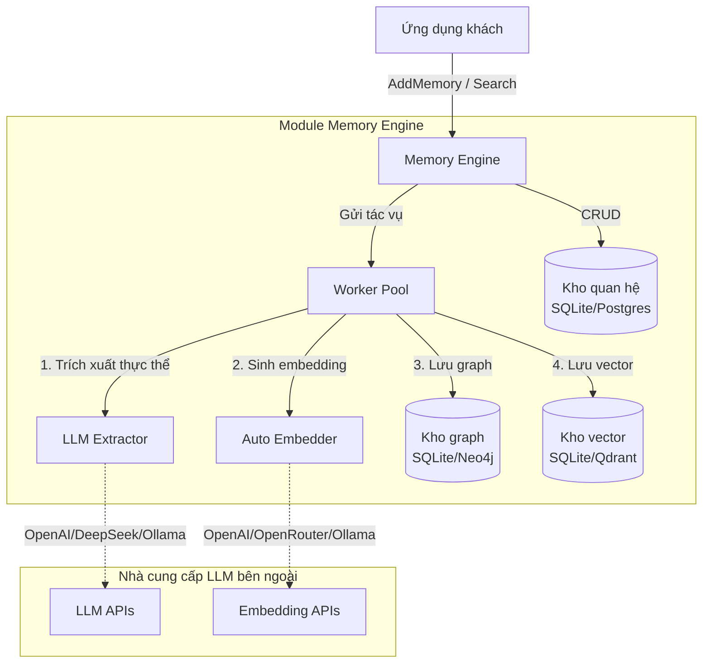
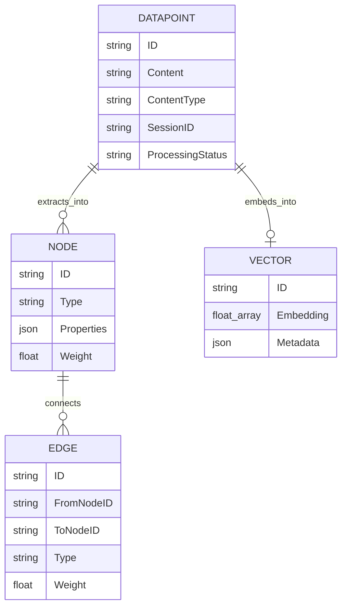
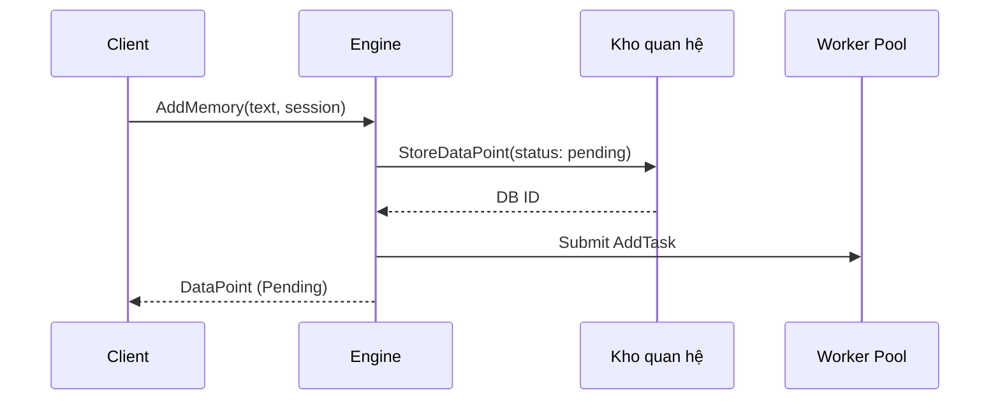
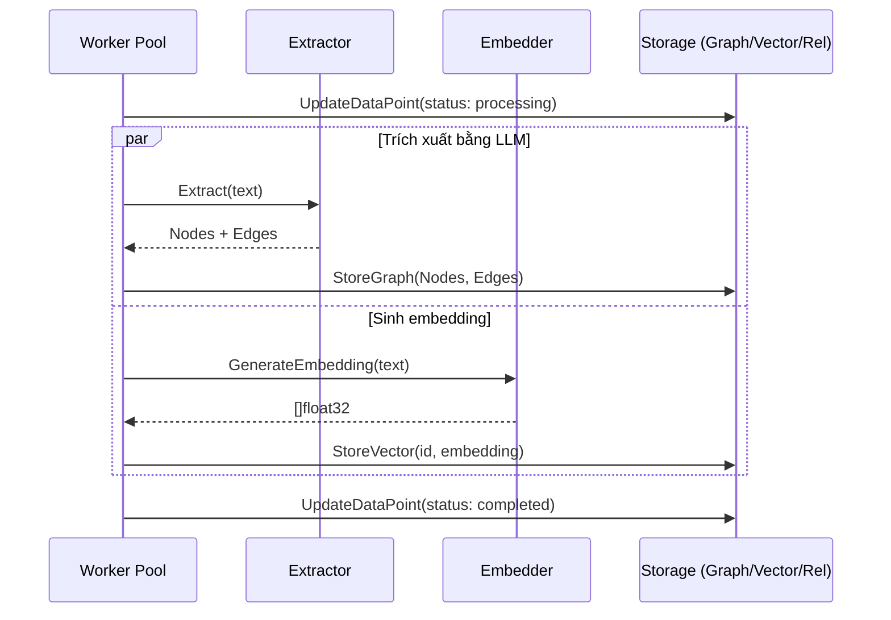
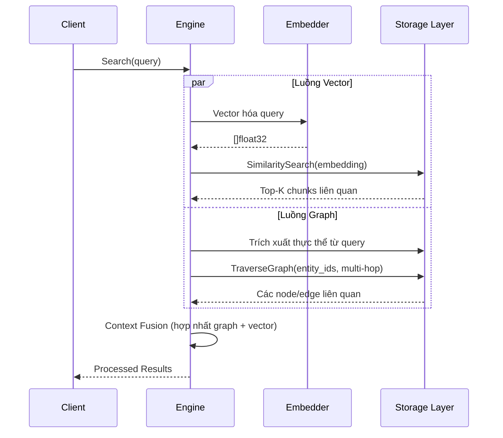
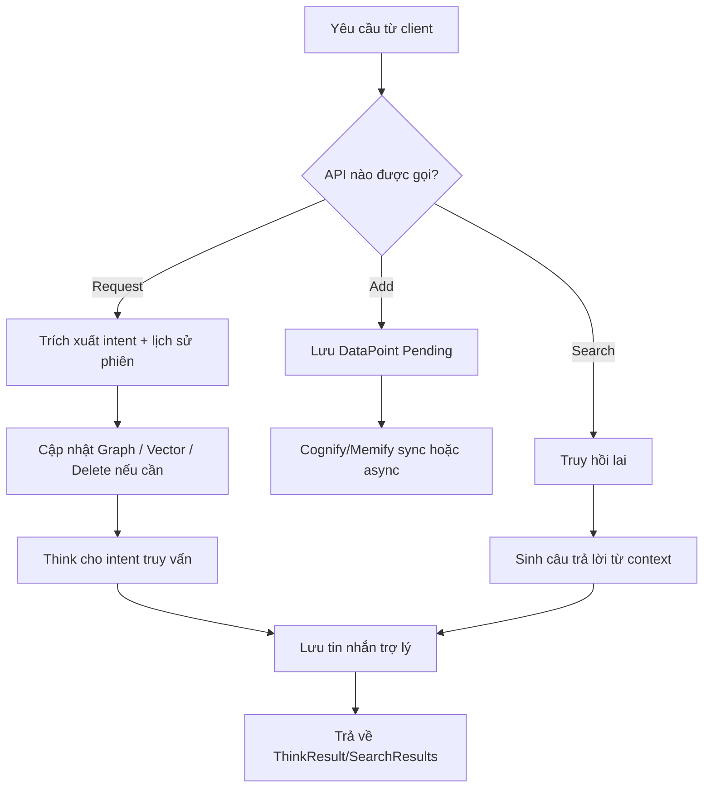
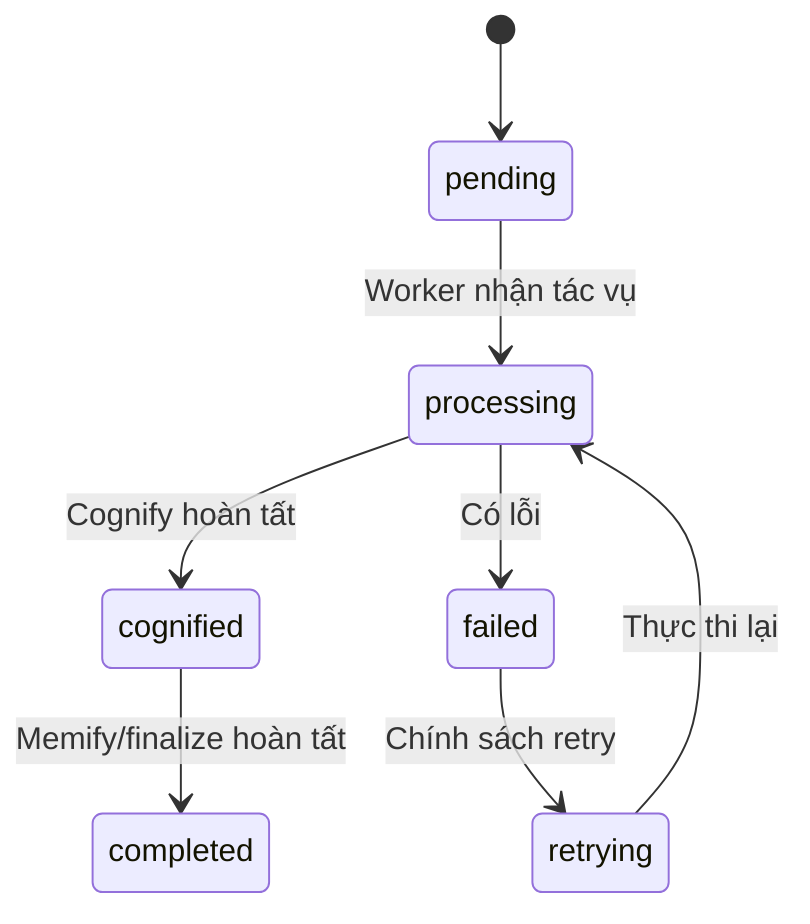
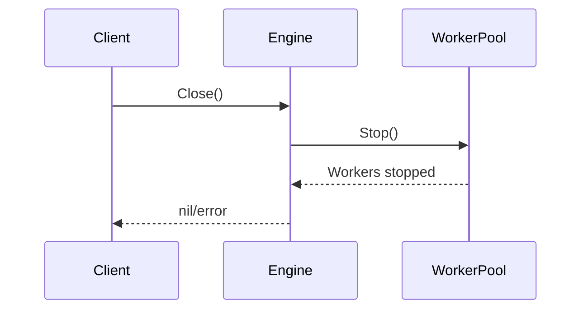
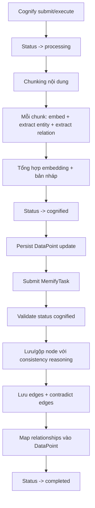

# AI Memory Brain - Tổng quan kiến trúc

Tài liệu này cung cấp phân tích kiến trúc và đặc tả luồng dữ liệu chi tiết cho dự án tích hợp `ai-memory-go`.

Hệ thống triển khai một `Memory Engine` thống nhất: tiếp nhận văn bản, trích xuất thực thể/quan hệ bằng mô hình ngôn ngữ lớn (LLM), sinh embedding vector và lưu trữ theo mô hình lai graph-vector để truy hồi ngữ nghĩa và quan hệ.

## Kiến trúc hệ thống



## Mô hình dữ liệu

Hệ thống vận hành trên ba lớp dữ liệu chính:

1. **DataPoint (quan hệ):** Biểu diễn dữ liệu đầu vào thô, metadata và trạng thái xử lý.
2. **Node & Edge (graph):** Biểu diễn khái niệm đã trích xuất và các quan hệ giữa chúng.
3. **Vector (embedding):** Biểu diễn ngữ nghĩa toán học của văn bản hoặc các đoạn đã tách.



## Các luồng cốt lõi

### 1. Luồng `AddMemory` (nạp dữ liệu)

Khi có thông tin mới, engine phản hồi ngay bằng cách lưu `DataPoint` thô ở trạng thái `pending`, sau đó xử lý bất đồng bộ qua worker pool.



### 2. Luồng `Cognify` (trích xuất & vector hóa)

Worker nền bất đồng bộ xử lý các dữ liệu đang ở trạng thái pending.



### 3. Luồng `Search` (truy hồi lai)

Pipeline tìm kiếm nhận query và truy hồi dữ liệu liên quan bằng hai luồng chạy song song: vector và graph.



## Phần 1 - Luồng chi tiết và logic từng thành phần

Phần này mô tả implementation hiện tại trong `engine` để thuận tiện debug, mở rộng và viết test.

### 1) Luồng tổng quan (end-to-end)



### 2) Logic chi tiết `Add` (ingestion)

Mục tiêu: tạo `DataPoint` ban đầu, có session, có trạng thái và tránh lưu trùng.

1. Khởi tạo `AddOptions` và metadata.
2. Resolve `sessionID` theo thứ tự ưu tiên:
   - `WithSessionID(...)`
   - `metadata["session_id"]` hoặc `metadata["sessionID"]`
   - fallback `"default"`
3. Chống trùng theo nội dung exact trong cùng session:
   - Query `storage.QueryDataPoints` với `SearchMode: "exact"`.
   - Nếu đã tồn tại thì trả về bản ghi cũ.
4. Tạo `DataPoint` mới:
   - `ID`: UUID
   - `ContentType`: `"text"`
   - `ProcessingStatus`: `pending`
5. Persist vào relational store (`StoreDataPoint`).
6. Trả về `DataPoint` để caller có thể `Cognify` ngay hoặc để worker xử lý sau.

### 3) Logic chi tiết `Cognify`

Mục tiêu: biến DataPoint thành tri thức có thể truy hồi (graph + vector).

1. Đọc `consistency_threshold` từ `DataPoint.Metadata` (nếu có).
2. Tạo `CognifyTask`.
3. Nếu `WithWaitCognify(true)`:
   - Chạy đồng bộ `task.Execute(...)`.
4. Nếu không:
   - Đẩy task vào `workerPool.Submit(...)`.
5. Trong task (tổng quan):
   - Trích xuất entity/relationship qua extractor.
   - Tạo embedding qua embedder.
   - Ghi vào graph/vector store.
   - Cập nhật processing status.

### 4) Logic chi tiết `Memify`

Mục tiêu: hoàn tất bước tích hợp memory sau cognify (promotion/consistency updates).

1. Đọc `consistency_threshold` từ metadata.
2. Tạo `MemifyTask`.
3. Cho phép 2 chế độ:
   - Sync (`WaitUntilComplete`)
   - Async (`Submit` vào worker pool)
4. Task xử lý các bước hoàn thiện để memory có trạng thái ổn định phục vụ retrieval.

### 5) Logic chi tiết `Request` (điểm vào hội thoại theo session)

`Request` là luồng phức hợp nhất vì vừa "nhớ", vừa "trả lời", vừa "xóa".

1. Lưu user message vào session history.
2. Lấy 10 message gần nhất (`getHistoryBuffer`) để bổ sung context.
3. Gọi `ExtractRequestIntent` để xác định:
   - có phải query?
   - có phải delete?
   - có cần vector storage?
   - có relationship nào được nêu?
4. Nếu có relationships:
   - `processRelationships` tìm/tạo node.
   - Tạo edge trong graph.
5. Nếu là delete intent:
   - Tìm node theo target và xóa.
   - Tạo embedding target, tìm vector tương đồng, xóa memory liên quan.
6. Nếu là statement/fact:
   - Extract entities + edges.
   - Store vào graph theo session.
7. Nếu cần vector memory:
   - `Add(...)` rồi `Cognify(...)`.
8. Nếu là query:
   - Tạo `ThinkQuery` và gọi `Think(...)`.
9. Tạo fallback answer nếu không có answer:
   - Delete -> `"I have forgotten ..."`
   - Còn lại -> `"I have memorized ..."`
10. Lưu assistant message vào session history.
11. Trả về `ThinkResult`.

### 6) Logic chi tiết `Search` (hybrid retrieval)

Có 2 chế độ vận hành:
- **Fallback `basicSearch`** khi thiếu graph/vector store.
- **Full Hybrid Search** khi đủ store.

Trong chế độ Full Hybrid Search, luồng xử lý được cập nhật như sau:

#### Bước 1: Trích xuất thực thể và Vector hóa

1. Hệ thống nhận câu hỏi người dùng.
2. Đồng thời thực hiện:
   - Vector hóa câu hỏi (`GenerateEmbedding`) để phục vụ semantic search.
   - Nhận diện thực thể quan trọng trong câu hỏi (NLP/LLM entity extraction).
3. Có thể bổ sung history gần nhất theo session để tăng độ chính xác khi nhận diện thực thể.

#### Bước 2: Tìm kiếm đa luồng (Multi-hop Retrieval)

Hai luồng chạy song song:

- **Vector Search**
  - Tìm các đoạn/chunk có độ tương đồng ngữ nghĩa cao nhất với query.
  - Có thể dùng keyword tinh chỉnh để tạo embedding tốt hơn.

- **Graph Traversal**
  - Từ thực thể đã nhận diện, tìm các node neo (anchor nodes).
  - Duyệt đồ thị nhiều hop (`hopDepth`) để lấy các node/quan hệ liên quan, kể cả khi không xuất hiện trực tiếp trong vector top-k.

#### Bước 3: Hợp nhất ngữ cảnh (Context Fusion)

1. Gộp kết quả từ hai luồng:
   - Graph cung cấp "bản đồ" quan hệ và ngữ cảnh liên kết.
   - Vector cung cấp "chi tiết" nội dung gần nghĩa với câu hỏi.
2. Tính điểm tổng hợp và rerank (vector + graph + temporal).
3. Tạo `ParsedContext` cuối cùng để:
   - trả danh sách `SearchResult`.
   - hoặc sinh câu trả lời bằng LLM (nếu provider khả dụng).

### 7) Logic chi tiết `DeleteMemory`

1. Nếu có `id`:
   - Validate memory đúng session (nếu có sessionID).
   - Xóa node graph liên kết `source_id = id`.
   - Xóa DataPoint trong relational.
2. Nếu không có `id` nhưng có `sessionID`:
   - Xóa toàn bộ DataPoints của session.
3. Nếu thiếu cả hai:
   - Trả lỗi.

### 8) Logic chi tiết `AnalyzeHistory` (nền)

1. Lấy toàn bộ session messages.
2. Nếu lịch sử quá ngắn (< 2) thì bỏ qua.
3. Build history text (tối đa 50 tin gần nhất).
4. Extract entities + relationships từ history.
5. Persist vào graph store.
6. Luồng này có thể chạy nền theo ticker nếu `EnableBackgroundAnalysis = true`.

### 9) Processing status và chuyển trạng thái



### 10) Ghi chú implementation Phần 1

- Session là khóa tách memory context theo user/cuộc hội thoại.
- `Request` ưu tiên "intent first", sau đó mới route đến graph/vector/think.
- `Search` ưu tiên retrieval lai (vector + graph) trước khi tạo answer bằng LLM.
- Cách rerank hiện tại đã dùng trong implementation và có thể tinh chỉnh theo use case.
- Fallback mode vẫn hoạt động dù graph/vector không khả dụng.

## Phần 2 - Tất cả luồng (full flow catalog)

Mục này liệt kê đầy đủ các luồng trong `MemoryEngine` theo interface và task runtime.

### A) Danh sách toàn bộ luồng public API

1. `Add`
2. `Cognify`
3. `CognifyPending`
4. `Memify`
5. `Search`
6. `Think`
7. `AnalyzeHistory`
8. `Request`
9. `DeleteMemory`
10. `Health`
11. `Close`

### B) Luồng khởi tạo và vòng đời

#### B.1 Khởi tạo engine

```mermaid
flowchart LR
    A[NewMemoryEngine / NewMemoryEngineWithStores] --> B[Kiểm tra MaxWorkers]
    B --> C[Tạo WorkerPool]
    C --> D[Khởi động WorkerPool]
    D --> E{Bật EnableBackgroundAnalysis?}
    E -->|Có| F[Khởi động ticker goroutine]
    E -->|Không| G[Engine sẵn sàng]
    F --> H[Định kỳ AnalyzeHistory(default)]
    H --> G
```

#### B.2 Tắt hệ thống



### C) Luồng chuỗi task trong worker pool



### D) Luồng `CognifyPending`

1. Query DataPoints theo `sessionID`.
2. Lọc các item có status `pending`.
3. Gọi `Cognify(..., WithWaitCognify(true))` cho từng item.
4. Ghi log item lỗi và tiếp tục item kế tiếp.

### E) Luồng `Think` đầy đủ

#### E.1 Logic điều phối

```mermaid
flowchart TD
    A[Think(query)] --> B{Extractor/provider khả dụng?}
    B -->|Không| C[Trả lỗi]
    B -->|Có| D{Bật AnalyzeQuery?}
    D -->|Có| E[LLM AnalyzeQuery]
    D -->|Không| F[Dùng analysis sẵn có]
    E --> G[retrieveContext]
    F --> G
    G --> H{Bật EnableThinking?}
    H -->|Không| I[singleShotThink]
    H -->|Có| J[iterativeThink]
    I --> K[ThinkResult]
    J --> K
```

#### E.2 `singleShotThink`

1. Nếu context quá lớn và `SegmentContext=true` -> dùng `segmentedThinkStep`.
2. Build JSON schema prompt (có/không reasoning).
3. Inject session history + parsed context.
4. Gọi provider completion.
5. Parse JSON; nếu lỗi thì fallback sang plain answer.

#### E.3 `iterativeThink`

1. Lặp tối đa `MaxThinkingSteps` (mặc định 3).
2. Mỗi vòng:
   - Prompt JSON bắt buộc: `reasoning`, `missing_entities`, `answer`.
   - Nếu đã có answer và không còn missing entities -> kết thúc.
   - Nếu cần bổ sung context:
     - Graph lookup theo `missing_entities`.
     - Lấy connected nodes.
     - Có thể thêm vector memories theo embedding của entity.
3. Nếu bật `LearnRelationships`:
   - Extract bridging relation và ghi vào graph.
4. Hết số hop mà vẫn thiếu -> trả fallback `"mảnh ký ức chưa tồn tại..."`.

#### E.4 Segmented thinking

- `segmentedThinkStep`: chia context theo segment, phân tích tuần tự, tích lũy reasoning.
- `segmentedThinkIteration`: giống iterative nhưng xử lý theo từng segment để tránh vượt context window.

### F) Luồng `Request` chi tiết theo từng nhánh intent

```mermaid
flowchart TD
    A[Request(session, content)] --> B[Lưu tin nhắn user]
    B --> C[Tải history buffer]
    C --> D[ExtractRequestIntent]
    D --> E{Có relationships?}
    E -->|Có| F[processRelationships]
    E -->|Không| G[Bỏ qua]
    F --> H{Là delete?}
    G --> H
    H -->|Có| I[Xóa graph/vector targets]
    H -->|Không| J[Bỏ qua]
    I --> K{Là statement/fact?}
    J --> K
    K -->|Có| L[Extract entities+edges và lưu graph]
    K -->|Không| M[Bỏ qua]
    L --> N{NeedsVectorStorage?}
    M --> N
    N -->|Có| O[Add + Cognify]
    N -->|Không| P[Bỏ qua]
    O --> Q{Là query?}
    P --> Q
    Q -->|Có| R[Think]
    Q -->|Không| S[Default answer]
    R --> T[Lưu tin nhắn trợ lý]
    S --> T
    T --> U[Trả ThinkResult]
```

### G) Luồng `Search` (các chế độ vận hành)

1. Chế độ fallback:
   - Nếu thiếu graph hoặc vector store -> `basicSearch`.
2. Chế độ hybrid đầy đủ:
   - `retrieveContext` (vector + entity anchors + graph traversal + rerank).
   - Tạo `ParsedContext`.
   - Nếu có LLM provider -> sinh câu trả lời cuối.
   - Nếu không có kết quả -> fallback no-context message.

### H) Luồng `DeleteMemory` đầy đủ

- Nhánh 1: xóa theo `id` (validate session ownership, xóa graph nodes liên kết, xóa DataPoint).
- Nhánh 2: xóa theo `sessionID` (xóa hàng loạt DataPoints của session).
- Nhánh 3: thiếu input -> trả lỗi.

### I) Luồng `AnalyzeHistory` (làm giàu nền định kỳ)

1. Tải session messages.
2. Nếu < 2 message -> no-op.
3. Build history text (tối đa 50 message gần nhất).
4. Extract entities + relationships.
5. Persist vào graph.
6. Được trigger bởi ticker nền nếu bật.

### J) Luồng lỗi/fallback (quan trọng khi vận hành)

1. LLM không khả dụng trong `Think` -> trả lỗi.
2. Lỗi parse JSON ở think step -> fallback answer dạng text.
3. Chunk embedding lỗi ở một chunk -> bỏ chunk đó, tiếp tục chunk khác.
4. Graph/vector operation lỗi cục bộ -> log warning, pipeline vẫn tiếp tục.
5. Gọi `Memify` sai status -> trả lỗi ngay.
6. `Search` thiếu stores -> tự động fallback `basicSearch`.

## Phụ thuộc package và năng lực

- **`extractor`**: lớp trừu tượng cho LLM để trích xuất thực thể có cấu trúc. Hỗ trợ `Anthropic`, `DeepSeek`, `Gemini`, `Ollama`, `OpenAI`.
- **`vector`**: lớp trừu tượng cho mô hình embedding và vector database. Hỗ trợ `AutoEmbedder` (có cache/fallback), `Ollama`, `OpenAI`, `OpenRouter`. Backend lưu trữ gồm `SQLite` (`sqlite-vec`), `Qdrant`, `PgVector`.
- **`graph`**: lớp trừu tượng cho thao tác knowledge graph (tạo node, tạo edge, duyệt BFS đệ quy). Hỗ trợ `SQLite` (Recursive CTE) và `Neo4j`.
- **`storage`**: kho quan hệ truyền thống để theo dõi `DataPoint`, hỗ trợ `SQLite` và `PostgreSQL`.
- **`engine`**: tầng điều phối tổng thể, bao bọc extractor/embedder/storage và vận hành qua `WorkerPool` đồng thời.
